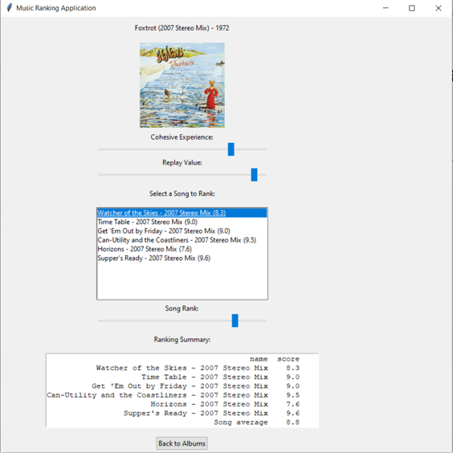

# Album Ranking App
Like it sounds. Saves your scores for songs and albums, and lets you view album scores.
Uses Spotify API.

For example, this is when you rank an album:

## What it does
There are three types of scores:
* Cohesive Experience - whole album score. Controlled with a slider.
* Replay Value - whole album score. Controlled with a slider.
* Song score - after pressing on a song, move the slider to choose its score.

The final album score is calculated as such:

$score = clip(s + \frac{c + r}{10} - 1, \[0,10\])$

where $s$ is the average over the songs on the album, $c$ is the cohesive experience and $r$ is the replay value.
$clip$ mean we clip the value between 0 and 10.

## Parameters to change
The app requires API **CLIENT_ID** and **CLIENT_SECRET**. You can set those up in [consts.py](consts.py).
The app also saves the rankings for future use. By default it saves them in SpotifyRanks/, but you can change **PATH** in [consts.py](consts.py).

## Installation
    git clone https://github.com/roy-urbach/AlbumRank.git
or

    git clone git@github.com:roy-urbach/AlbumRank.git

## Usage
In your cmd, run from the correct directory:

    python3 AlbumRank.py

Otherwise:

    python3 <path_to_script>/AlbumRank.py

